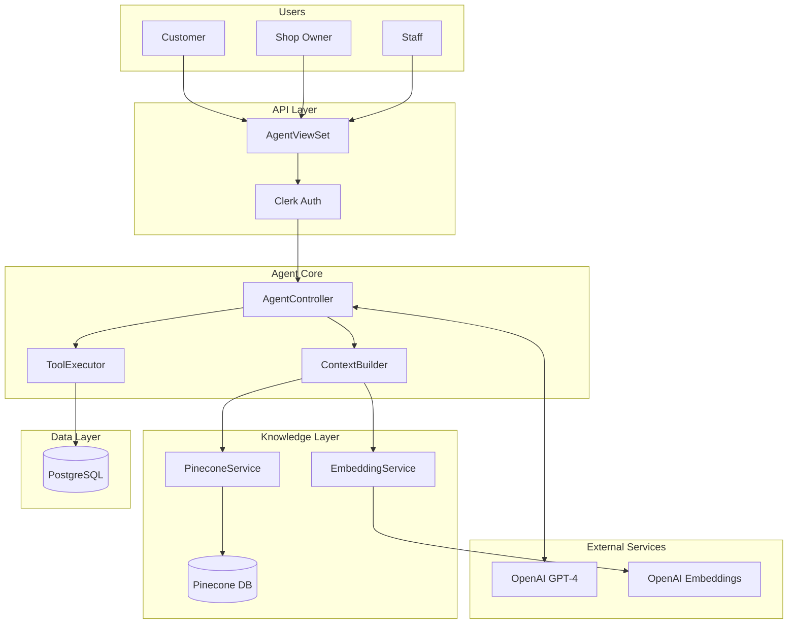
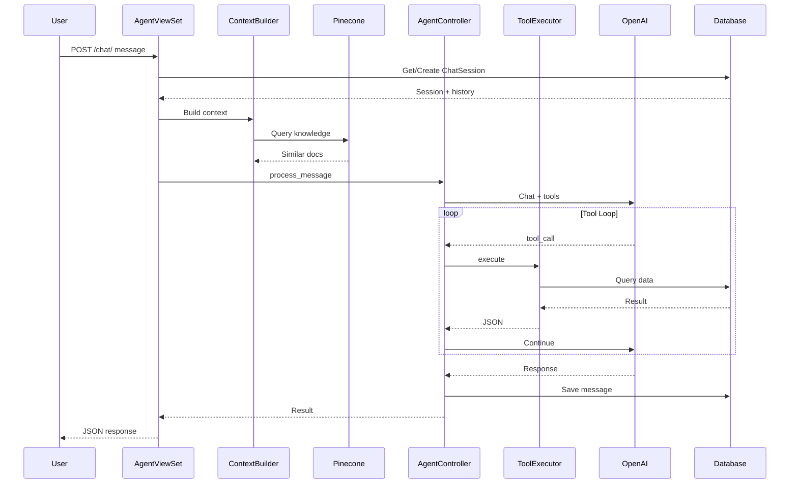
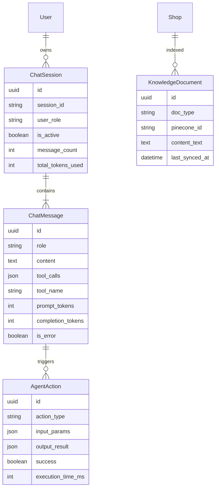
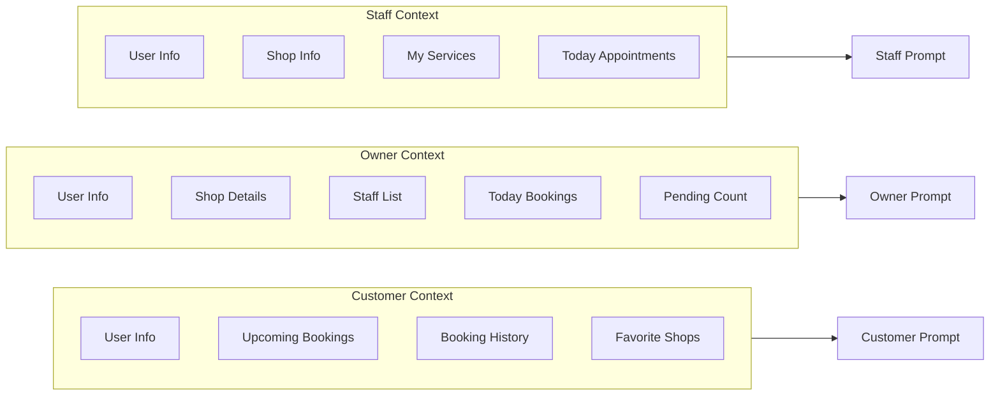
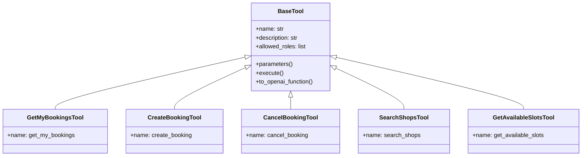
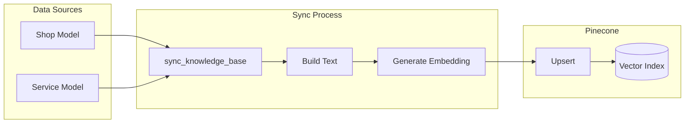
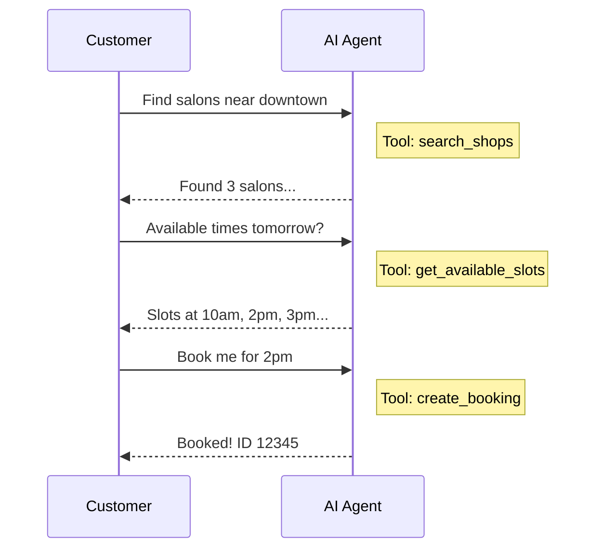
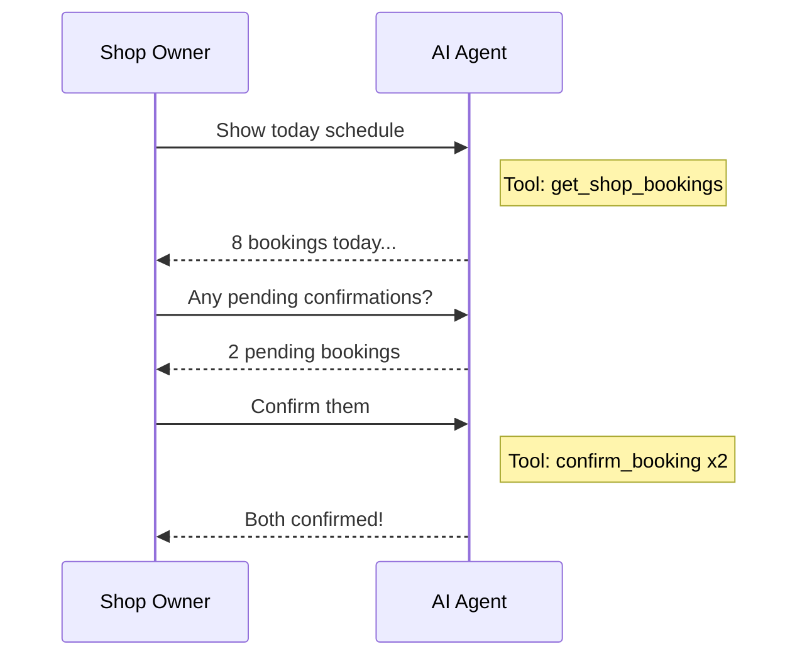

# BeautyDropAI Agent - Complete Documentation

## Overview

The BeautyDropAI Agent is an intelligent conversational assistant that helps users manage salon bookings, discover shops, and handle appointments. It uses **OpenAI GPT-4** for natural language understanding and **Pinecone** for semantic search over shop/service knowledge.

---

## System Architecture



---

## Request Flow



---

## Database Models



---

## Role-Based Context



---

## Tool System



### Available Tools by Role

| Tool                  | Customer | Owner | Staff | Description                       |
| --------------------- | :------: | :---: | :---: | --------------------------------- |
| `search_shops`        |    ✅    |       |       | Search shops by name/city/service |
| `get_shop_info`       |    ✅    |  ✅   |  ✅   | Get detailed shop information     |
| `get_shop_services`   |    ✅    |  ✅   |  ✅   | List services with prices         |
| `get_shop_staff`      |    ✅    |  ✅   |       | List staff members                |
| `get_available_slots` |    ✅    |  ✅   |  ✅   | Check booking availability        |
| `get_shop_hours`      |    ✅    |  ✅   |  ✅   | Get weekly operating hours        |
| `get_shop_holidays`   |    ✅    |  ✅   |  ✅   | Get upcoming closures             |
| `get_my_bookings`     |    ✅    |       |  ✅   | View own bookings                 |
| `create_booking`      |    ✅    |       |       | Book an appointment               |
| `cancel_booking`      |    ✅    |  ✅   |       | Cancel a booking                  |
| `get_shop_bookings`   |          |  ✅   |       | View all shop bookings            |
| `confirm_booking`     |          |  ✅   |       | Confirm pending booking           |

---

## Pinecone Integration



---

## API Reference

### Chat Endpoint

```
POST /api/v1/agent/chat/
```

**Request:**

```json
{
  "message": "I want to book a haircut tomorrow",
  "session_id": "optional-uuid"
}
```

**Response:**

```json
{
  "response": "I found available slots for haircuts tomorrow...",
  "session_id": "abc123-uuid",
  "message_id": "msg-uuid",
  "actions_taken": [
    {
      "action_type": "get_available_slots",
      "success": true,
      "details": { "slot_count": 8 }
    }
  ],
  "tokens_used": {
    "prompt": 450,
    "completion": 120
  }
}
```

### Session Endpoints

| Method | Endpoint                           | Description               |
| ------ | ---------------------------------- | ------------------------- |
| GET    | `/api/v1/agent/sessions/`          | List all user sessions    |
| GET    | `/api/v1/agent/sessions/{id}/`     | Get session with messages |
| POST   | `/api/v1/agent/sessions/{id}/end/` | End a session             |
| DELETE | `/api/v1/agent/sessions/{id}/`     | Delete session            |

---

## Conversation Examples

### Customer Booking Flow



### Owner Management Flow



---

## File Structure

```
apps/agent/
├── models.py                    # Database models
├── admin.py                     # Admin interface
├── serializers.py               # API serializers
├── views.py                     # API views
├── urls.py                      # URL routing
├── services/
│   ├── agent_controller.py      # Main orchestration
│   ├── context_builder.py       # Role context + RAG
│   ├── embedding_service.py     # OpenAI embeddings
│   ├── pinecone_service.py      # Vector DB
│   └── tool_executor.py         # Tool management
├── tools/
│   ├── base.py                  # BaseTool class
│   ├── booking_tools.py         # Booking operations
│   ├── shop_tools.py            # Shop queries
│   └── schedule_tools.py        # Availability checks
├── prompts/
│   └── system_prompts.py        # Role prompts
└── management/commands/
    └── sync_knowledge_base.py
```

---

## Environment Variables

```bash
# OpenAI
OPENAI_API_KEY=sk-...
OPENAI_MODEL=gpt-4-turbo-preview

# Pinecone
PINECONE_API_KEY=pc-...
PINECONE_INDEX_NAME=beautydrop-knowledge
```

---

## Admin Debugging

Access `/admin/` to view:

- **Chat Sessions**: View all conversations, user roles, token usage
- **Chat Messages**: See every message with role, tokens, processing time
- **Agent Actions**: Audit log with input/output, success status, timing
- **Knowledge Documents**: Track Pinecone sync status per shop/service
